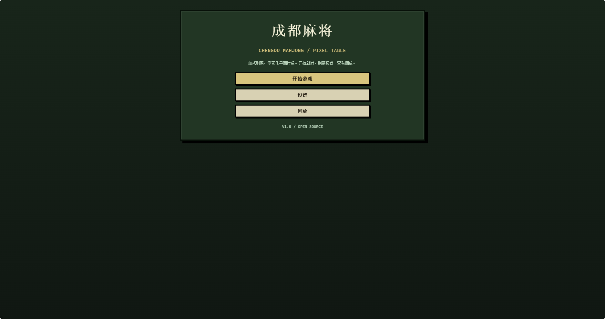
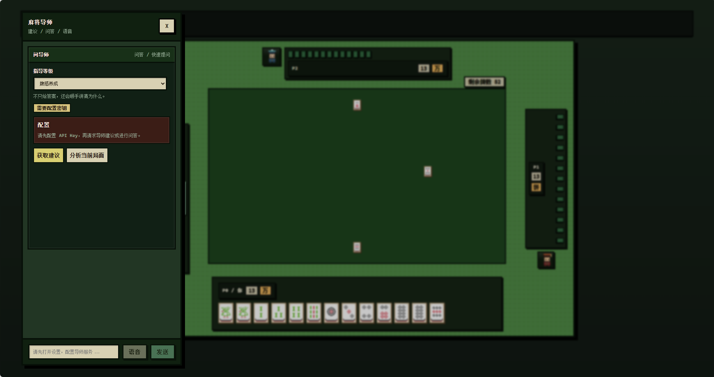

# 成都麻将 AI 教学平台

成都血战麻将 AI 对局与训练平台，支持规则引擎、自博弈训练、策略评估和可选 LLM 战术讲解。

这个项目不是单纯的麻将页面，而是一套围绕“成都麻将怎么打、AI 为什么这样打、玩家该怎么学”的前端实验平台。核心对局逻辑由 TypeScript 规则引擎驱动，AI 决策基于向听、进张、危险度、风格、对手威胁等可解释特征；LLM 只负责把结构化分析转成教练式语言，不参与真实出牌决策。

## 界面预览





## 核心能力

- 成都血战规则：换三张、定缺、碰杠胡响应、血战到底、多家胡牌、流局结算。
- 规则包架构：`RulePack` 抽象隔离规则，当前包含 `placeholder` 和 `chengdu` 两套规则包。
- 可解释 AI：结合向听数、有效牌、危险度、局面风格、对手画像和威胁评分选择动作。
- 像素牌桌 UI：提供首页、设置、对局、回放页面，支持 Table/Debug 两种对局视图。
- AI 导师：可接入 Kimi Coding 或 OpenAI Compatible 接口，提供局面建议、问答、语音入口和复盘总结。
- 训练系统：支持自博弈、并行训练、参数持久化、在线学习式参数叠加。
- 分析系统：包含单局复盘、多局报告、人类玩家画像、错误模式、教学计划、群体洞察和 A/B 教学评估。
- LLM 评测：内置换三张等阶段的 prompt 评测 CLI，可生成测试用例、调用模型并输出报告。
- 回放与日志：对局事件流可导出回放，游戏过程可用于复盘和统计。

## 技术栈

- Vite + TypeScript
- PixiJS 牌桌渲染
- Vitest 单元测试
- pnpm 包管理
- Vercel Serverless API 代理

## 快速开始

```bash
pnpm install
pnpm dev
```

启动后打开：

```text
http://localhost:5173/
```

常用命令：

```bash
pnpm dev        # 本地开发
pnpm test:run   # 运行单元测试
pnpm build      # 构建生产产物
pnpm preview    # 预览构建结果
pnpm train      # 自博弈训练
pnpm ai-eval    # LLM 提示词评测
```

项目声明了 `pnpm@9.15.0` 和 Node.js `20.x`。如果使用其他包管理器，依赖解析结果可能和锁文件不完全一致。

## LLM 配置

LLM 是可选能力。没有配置 API Key 时，麻将对局、AI 出牌、规则校验、训练和回放都可以正常运行。

本地开发可以复制环境变量模板：

```bash
cp .env.example .env.local
```

`.env.local` 示例：

```bash
KIMI_API_KEY=
```

然后在应用的设置页打开“LLM 导师”，进入“LLM 设置”配置模型、入口地址和密钥。当前默认提供：

- Kimi Coding / Anthropic 格式：`/api/llm/kimi/messages`
- OpenAI Compatible 格式：可填写兼容 `/chat/completions` 的服务地址

安全说明：

- 仓库不内置 API Key，`.env.example` 也保持空值。
- `.env.local` 已被 `.gitignore` 忽略，不应提交到版本控制。
- 生产环境建议使用后端代理或平台环境变量，不要把真实 Key 打进前端产物。

## 玩法与界面

首页提供三个入口：

- 开始游戏：创建一局成都麻将。
- 设置：切换规则、语言、UI 模式、超时、P0 AI 模式、训练参数和 LLM 配置。
- 回放：查看最近导出的对局事件流。

对局页支持两种显示模式：

- Table 模式：像素化四人牌桌，适合实际游玩。
- Debug 模式：显示手牌分析、推荐出牌、事件日志和调试信息，适合观察 AI 决策。

P0 默认是人类玩家，也可以在设置页切换为 AI 模式，用于快速跑 AI vs AI 对局。

## 规则系统

规则入口位于：

```text
src/core/rules/
```

主要模块：

- `RulePack.ts`：规则包接口，约束牌集、初始状态、合法动作、动作应用、响应裁决和结算。
- `RuleRegistry.ts`：规则包注册与查找。
- `packs/placeholder`：最小规则包，用于基础轮转和框架验证。
- `packs/chengdu`：成都血战规则包。

成都规则目前覆盖：

- 换三张、定缺。
- 缺门出牌校验。
- 摸牌、出牌、碰、明杠、暗杠、加杠、胡、过。
- 点炮、自摸、杠上开花、抢杠胡。
- 多家同时胡牌与血战到底结束条件。
- 番型与分数计算，包括平胡、对对胡、全带幺、七对子、清一色、龙七对、金钩钓、天胡/地胡等（注：门清、混一色当前未计入番数）。

## AI 决策

AI 相关代码位于：

```text
src/agents/algo/
```

核心思路是“可解释的启发式策略”，而不是黑箱模型：

- `shanten.ts`：普通型向听计算。
- `expectedValue.ts` / `bloodBattleEV.ts`：效率与血战收益评估。
- `danger.ts`：近似放铳风险评估。
- `style.ts`：进攻、均衡、防守、拖局等局面风格识别。
- `opponentModel.ts`：对手画像和威胁估计。
- `policy_high.ts`：综合效率、风险、风格、威胁和训练参数做最终选择。
- `aiParams.ts`：AI 参数存取与调参入口。

LLM 不参与这些决策，只在需要时解释“为什么推荐这样打”。

## 教学与分析

分析模块位于：

```text
src/analysis/
src/meta/
```

已实现的分析能力包括：

- 单步手牌分析与推荐。
- 单局统计、风格级复盘。
- 多局管理与元策略参数调整。
- 人类玩家画像：风险承受、效率倾向、防守意识、打法风格、学习阶段。
- 错误模式检测：贪效率、后巡不防守、过早副露、风格摇摆等。
- 个性化教学计划：根据玩家阶段选择教学语气和重点。
- 群体分析：共性错误、学习路径、教学变体 A/B 效果评估。

## 训练与评测

训练模块位于：

```text
src/training/
scripts/
```

支持：

- 前端设置页触发训练。
- CLI 自博弈训练。
- 并行 Worker 训练。
- 参数持久化与在线学习记录。
      - AI 评测 CLI，对 LLM 在指定阶段的建议进行规则校验。

> ⚠️ **训练系统准确性说明**：`TrainingConfig.mode='baseline'` 当前与 `mirror` 等效（所有玩家共享同一套参数，未独立实现「对手用 best、训练者用候选」的区分，`autoRun.ts` 自承）；`neuralTrainer.ts` 的神经网络训练为示意性实验（`updateWeights` 为随机扰动），`NeuralNetwork` 未被任何出牌决策路径调用。对外宣称「神经网络 AI」「智能训练」均不准确——本项目的 AI 决策为可解释启发式，神经网络仅属实验性探索。

AI 评测示例：

```bash
pnpm ai-eval --dry-run
pnpm ai-eval --count 10 --prompts advice
```

可用环境变量：

```bash
KIMI_API_KEY=
AI_EVAL_ENDPOINT=
AI_EVAL_API_KEY=
AI_EVAL_MODEL=
AI_EVAL_FORMAT=anthropic
AI_EVAL_DELAY=2000
```

## 测试覆盖

测试位于：

```text
tests/
```

覆盖方向包括：

- 成都规则、向听、危险度和高阶策略。
- 风格差异、威胁差异、对手画像。
- 多局元策略、玩家画像、错误模式、教学计划、群体分析。
- LLM 浏览器配置、Kimi 代理、代理路由。
- 设置存储、策略上下文等基础模块。

运行：

```bash
pnpm test:run
```

## 目录速览

```text
api/                  Vercel API 代理
docs/                 策略知识与设计文档
resource/             麻将牌图片资源
scripts/              训练与评测 CLI
src/agents/           玩家代理、AI 策略（可解释启发式）、神经网络实验（实验性，未接入决策路径）
src/analysis/         复盘、画像、教学与群体分析
src/core/             牌、状态、动作、事件与规则系统
src/llm/              LLM 服务、Prompt、历史存储与浏览器配置
src/meta/             多局元策略
src/orchestration/    对局编排器
src/persistence/      回放与存储
src/store/            UI 设置、语言与游戏状态
src/testing/          AI 评测用例、校验器和报告
src/training/         自博弈训练、并行训练与参数优化
src/ui/               页面、组件、Pixi 牌桌与样式
tests/                Vitest 测试
```

## 项目定位

这个项目适合用于：

- 研究成都血战麻将规则建模。
- 观察可解释麻将 AI 的决策过程。
- 搭建麻将教学、复盘和玩家画像实验。
- 评测 LLM 在麻将教学提示词上的规则遵循能力。

它刻意把“决策”和“表达”分开：规则和 AI 决策保持确定、可测、可复现；LLM 只负责把分析结果讲清楚。
